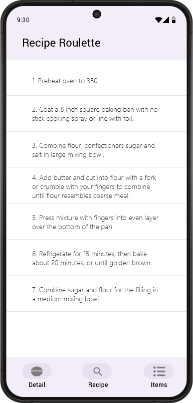

# Házi feladat specifikáció

Információk [itt](https://viaumb02.github.io/laborok/android/A01/)

## Mobilszoftver Laboratórium
### [Dátum - 2024 tavaszi félév]
### Dittrich Ákos - (ZESBP0)
### Laborvezető: Hideg Attila

## Recipe Roulette

## Bemutatás

Az alkalmazás egy véletlen recept generátort kínál, ami segít az embereknek új és izgalmas ételek felfedezésében. Az ötlet abból született, hogy sokan keresnek új recepteket a mindennapi étkezéshez, de néha nehéz döntést hozni vagy inspirációt találni. Az alkalmazás célközönsége azok, akik szeretnek főzni vagy új ételeket kipróbálni, de szükségük van ötletekre vagy inspirációra.

## Főbb funkciók

Az alkalmazás minden funkciójára kiterjedő leírás. Legyen egyértelműen eldönthető, hogy az adott funkció implementálva van-e!
P.l.: Az alkalmazással lehetőség van térképen megjeleníteni az állomáspontokat és azok A,B,C,D tulajdonságai meg is jelennek (ha elérhetőek).
Alkalmazás actorainak, user story-knak, use-case-eknek bemutatása, use-case diagram használatával.

### Actorok:
Felhasználó: A végső felhasználó, aki az alkalmazást használja az ételreceptek felfedezésére és elkészítésére.

### User Storyk:
Felhasználóként szeretnék egy gombnyomással véletlenszerű receptet kapni, hogy új ételeket próbálhassak ki.

Felhasználóként szeretnék megtekinteni egy recept hozzávalóinak listáját, hogy előre felkészülhessek az étel elkészítésére.

Felhasználóként szeretnék megtekinteni egy recept részletes leírását, hogy könnyen elkészíthessem az adott ételt.

### Use-casek:
Véletlenszerű recept generálása
    A felhasználó kér egy véletlenszerű receptet.
    Az alkalmazás válaszol a véletlenszerűen kiválasztott recepttel.

Hozzávalók listájának megtekintése
    A felhasználó kiválaszt egy receptet.
    Az alkalmazás megjeleníti a recept hozzávalóinak listáját.

Recept leírásának megtekintése
    A felhasználó kiválaszt egy receptet.
    Az alkalmazás megjeleníti a recept részletes leírását.

## Képernyőtervek

## Architektúra ismertetése

Az MVVM (Model-View-ViewModel) architektúra egy hatékony tervezési minta, amely segít elkülöníteni az alkalmazás logikáját és a felhasználói felületet, ahol a ViewModel réteg közvetíti az adatokat a nézetréteg és a modell között. Ez a válaszotott architektúra tiszta és jól strukturált Android alkalmazások fejlesztését teszi lehetővé.

## Commit history

## Github actions

## Dokumentáció

### Hálózati réteg:

**RecipeApiService**: Ez az interfész felelős a receptekkel kapcsolatos API végpontok definálását szolgálja.

**RecipeRepository**: Ez az osztály felelős a receptekkel kapcsolatos hálózati adatelérés kezeléséért. 

**ApiModule**: A modul felelős a hálózati komponensek konfigurációjáért. A megfelelő kódgeneráláshot és megfelelő injektálásához Hilt Daggert használ a hálózati hívásokhoz szükséges objektumok létrehozásához (OkHttpClient, Retrofit, RecipeApiService, RecipeRepository) 

**Model osztályok**: Adatmodell oszályok az API kérés válaszának struktúráját leíró osztályok: AnalyzedInstruction, Equipment, ExtendedIngredient, Ingredient, Length, Measures, Metric, RandomRecipeResponse, Recipe, RecipeEntity, Step, Us

Az feladathoz [spoonacular](https://spoonacular.com/food-api/docs) API-t használtam. A használt végpont leírása [openapi leíró](openapi.yaml)-ban megtalálható.

### Adat réteg:

**RecipeDao**: Ez az interfész felelős a receptek adatbázisbeli műveleteinek definiálásáért.

**RecipeDatabase**:  Ez az absztrakt osztály felelős az alkalmazás adatbázisának inicializálásáért. 

**RecipeEntity**: Ezt a sémát használja a RecipeDatabase.

**DatabaseModule**: Ez a modul felelős az alkalmazás adatbázis komponenseinek konfigurációjáért. Biztosítja a RecipeDao és RecipeDatabase objektumok létrehozását és injektálását más osztályok számára a Hilt keretrendszer segítségével.

## Videó dokumentáció

A feladatmegoldást bemutató vidó a következő elérhetőségen található:
https://drive.google.com/file/d/1Lml5WqG6RAHz1RnS8MY5XfZAQHXFBI7H/view?usp=drive_link

